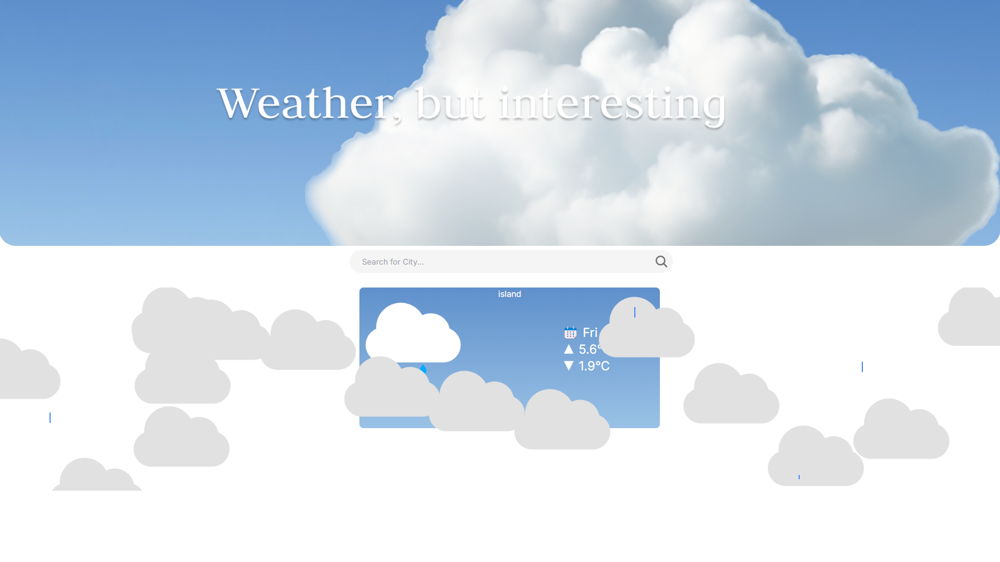

# lewis-hackathon
 Submission for the Lewis Menelaws Hackathon 

## Interactive Weather

> **Try it out on:**
> https://interactive-weather.vercel.app/


## How it Looks


## Host locally

To run this site locally

Clone it
```bash
  git clone https://github.com/illy-dev/lewis-hackathon
```
then cd in to the directory
```bash
cd lewis-hackathon
```
and install the dependecies
```bash
npm i
```
then run it with
```bash
npm run dev
```
